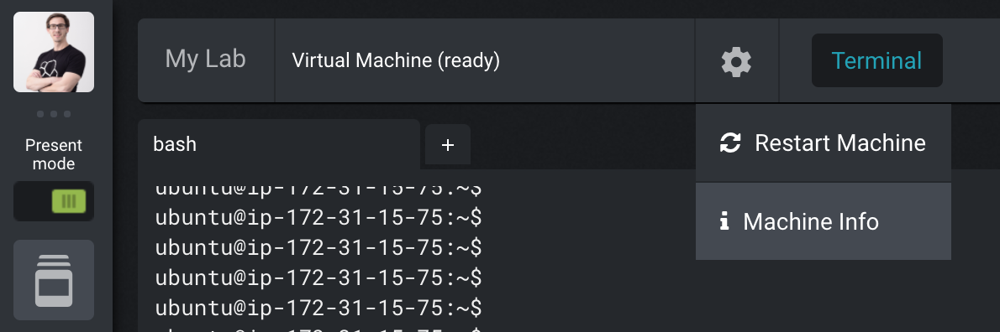

# Live Kubernetes Debugging with the Elastic Stack

Hands-on workshop on how to monitor Kubernetes with the Elastic Stack. Instead of a presentation, please use the steps in this readme.

## Workshop

We are running through this together and dive into the relevant parts. For the lab, head to *My Lab* in Strigo:

### Getting Started

1. Check that [K3s](https://k3s.io) is running: `sudo k3s kubectl get node`
1. You can access it just like Kubernetes: `sudo kubectl get pods --all-namespaces`
1. Install the Elastic Operator's Custom Resource Definition (CRD): `sudo kubectl create -f https://download.elastic.co/downloads/eck/1.9.1/crds.yaml`
1. Install the Elastic Operator itself: `sudo kubectl apply -f https://download.elastic.co/downloads/eck/1.9.1/operator.yaml`
1. Check its status, which should just show some logs from the Operator: `sudo kubectl -n elastic-system logs -f statefulset.apps/elastic-operator`

### Elasticsearch Setup

1. Create an Elasticsearch node: `sudo kubectl apply -f /opt/elastic-operator/elasticsearch.yml`
1. Watch the status of the node, which should turn *green* after a minute or two: `sudo kubectl get elasticsearch`
1. Especially if something fails, inspect the pod: `sudo kubectl get pods --selector='elasticsearch.k8s.elastic.co/cluster-name=elasticsearch'`
1. And check the logs: `sudo kubectl logs -f elasticsearch-es-default-0`
1. Check that the ClusterIP service has been created successfully: `sudo kubectl get service elasticsearch-es-http`
1. Fetch the generated password for the default user `elastic`: `PASSWORD=$(sudo kubectl get secret elasticsearch-es-elastic-user -o go-template='{{.data.elastic | base64decode}}') && echo $PASSWORD`
1. Expose Elasticsearch to localhost (in the background with `&` since this is a blocking call and redirect the output to `/dev/null`): `sudo kubectl port-forward service/elasticsearch-es-http 9200 > /dev/null &`
1. Access Elasticsearch but ignore the self-generated certifikate with `-k`: `curl -u "elastic:$PASSWORD" -k "https://localhost:9200"`
1. `kill` the port forwarding processes if needed after retrieving the PID: `ps aux | grep port-forward`

### Kibana Setup

1. Follow a similar approach for creating a Kibana instance.
1. Create a Kibana node: `sudo kubectl apply -f /opt/elastic-operator/kibana.yml`
1. Check the health of Kibana: `sudo kubectl get kibana`
1. If required, check the pod: `sudo kubectl get pod --selector='kibana.k8s.elastic.co/name=kibana'`
1. For Kibana a LoadBalancer should have been created automatically (doesn't need a `port-forward` any more): `sudo kubectl get service kibana-kb-http`
1. Copy the DNS name of your node under *Machine info*.

    

1. Access Kibana on that DNS name on port 5601 and ignore the bad certificate.
1. If you forgot the password for the user `elastic`: `echo $PASSWORD`

### Beats Setup

1. Filebeat with autodiscovery: `sudo kubectl apply -f /opt/elastic-operator/filebeat.yml`
1. Metricbeat with Kubernetes monitoring: `sudo kubectl apply -f /opt/elastic-operator/metricbeat.yml`
1. Heartbeat monitoring Elasticsearch: `sudo kubectl apply -f /opt/elastic-operator/heartbeat.yml`
1. Packetbeat monitoring DNS on port 53 and HTTP on ports 80, 8000, 8080, and 9200: `sudo kubectl apply -f /opt/elastic-operator/packetbeat.yml`
1. Check the health of all the Beat deployments, which might take a little while for them to turn green: `sudo kubectl get beat`
1. As well as the pods — for example for Metricbeat: `sudo kubectl get pods --selector='beat.k8s.elastic.co/name=metricbeat'`
1. Based on that output you can check the logs (the ID at the end will be different): `sudo sudo kubectl logs -f metricbeat-beat-metricbeat-fvvg6`

### Monitoring

1. See the underlying data for the Beats in Kibana's *Discover*.
1. Look at the visualizations in *Observability / Overview* and its subpages.

### Application Monitoring

1. Create a Spring Boot demo deployment: `sudo kubectl create deployment demo --image=springguides/demo --dry-run=client -o=yaml > deployment.yaml`
1. Add another section: `echo --- >> deployment.yaml`
1. Add the service: `sudo kubectl create service loadbalancer demo --tcp=8080:8080 --dry-run=client -o=yaml >> deployment.yaml`
1. Check the generated file: `cat deployment.yaml`
1. Create the pod: `sudo kubectl apply -f deployment.yaml`
1. Check what we have running now: `sudo kubectl get all`
1. Check the health of the instance on `<machine-dns>:8080/actuator/health` or `curl localhost:8080/actuator/health`.
1. Check the logs of the demo app for example by searching for `demo` in *Discover*.

## Terraform Setup

Make sure you have run this before the demo.

1. Have your AWS account set up, access key created, and added as environment variables in `AWS_ACCESS_KEY_ID` and `AWS_SECRET_ACCESS_KEY`. Protip: Use [https://github.com/sorah/envchain](https://github.com/sorah/envchain) to keep your environment variables safe.
1. Change the settings to a domain you have registered under Route53 in *inventory* and *variables.tf*. Set the Hosted Zone for that domain and export the Zone ID under the environment variable `TF_VAR_zone_id`. If you haven't created the Hosted Zone yet, you should set it up in the AWS Console first and then set the environment variable.
1. If you haven't installed the AWS plugin for Terraform, get it with `terraform init` first. Then create the keypair, DNS settings, and instances with `terraform apply`.
1. Apply the configuration to the instance with `ansible-playbook configure.yml`.

When you are done, remove the instances, DNS settings, and key with `terraform destroy`.

## Packer Setup for Strigo

To build an AWS AMI for [Strigo](https://strigo.io), use [Packer](https://packer.io). Using the [Ansible Local Provisioner](https://packer.io/docs/provisioners/ansible-local.html) you only need to have Packer installed locally (no Ansible). Build the AMI with `packer build packer.json` and set up the training class on Strigo with the generated AMI and the user `ubuntu`.

If things are failing for some reason: Run `packer build -debug packer-ansible.yml`, which will keep the instance running and save the SSH key in the current directory. Connect to it with `ssh -i ec2_amazon-ebs.pem ubuntu@ec2-X-X-X-X.eu-central-1.compute.amazonaws.com`; open ports as needed in the AWS Console since the instance will only open TCP/22 by default.
